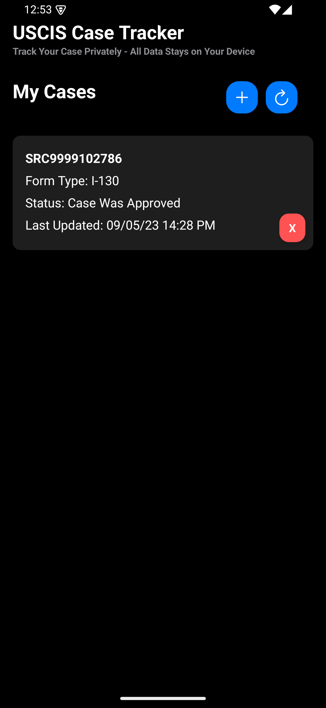
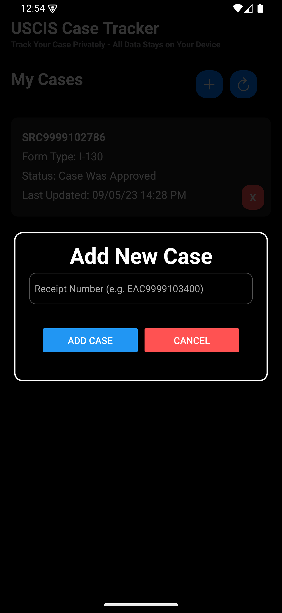
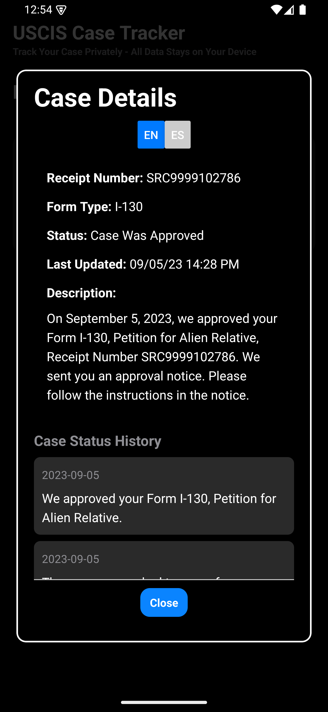
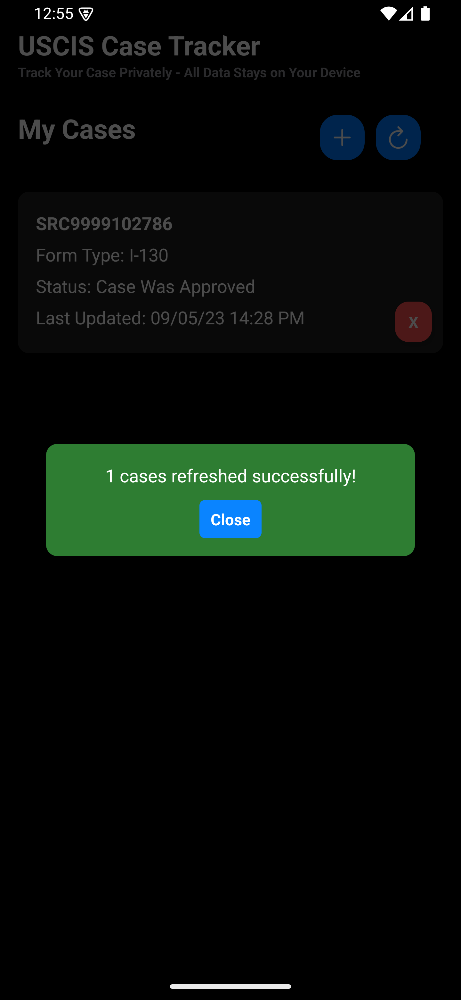

# USCIS Case Tracker

**USCIS Case Tracker** is a privacy-focused mobile application designed to help users track their USCIS case statuses conveniently and securely on their device. It allows users to add, refresh, and view detailed information about their case(s) without sharing data with external servers, ensuring complete privacy.

   

### Features

- **Add New Cases**: Easily add a new USCIS case by entering the receipt number.
- **View Case Details**: Get a comprehensive view of each case, including form type, status, last updated date, and additional descriptions.
- **Refresh Case Status**: Manually refresh case status to get the latest updates directly from USCIS.
- **Multi-Language Support**: View case details in multiple languages (e.g., English and Spanish).
- **Private & Secure**: All data is stored on the user’s device; no external data sharing, ensuring complete privacy.

### Applicaiton Demo

https://github.com/smannathan/uscis-case-tracker/blob/main/images/demo.mp4

### How to Use

1. **Add a Case**: 
   - Tap the **+** button on the Home screen.
   - Enter your USCIS case’s receipt number in the provided field.
   - Tap **Add Case** to save.
  
      

2. **View Case Details**:
   - Tap on a case in the list on the Home screen.
   - This will bring up detailed information, including the case history and latest status updates.
  
      

3. **Refresh Case Status**:
   - Tap the **refresh** icon on the Home screen.
   - A notification will confirm the status refresh and display the updated details.

      

4. **Delete a Case**:
   - Tap the red **X** button next to a case to remove it from the tracking list.

### Privacy Policy

Your data remains secure on your device, as the app does not send any data externally. This ensures that your case information is private and accessible only to you.

[Privacy Policy](PRIVACY_POLICY.md)

### Terms and Conditions

[Terms and conditions](TERMS_AND_CONDITIONS.md)

### Download

